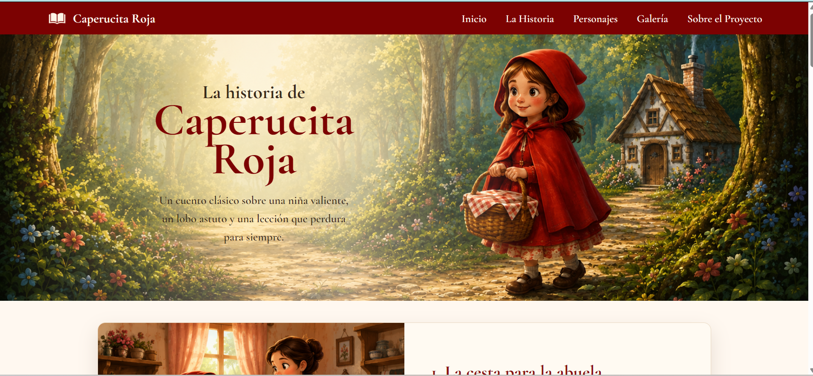

# Análisis

Este proyecto es una página web sobre “Caperucita Roja”.
La página tiene varias secciones con imágenes, texto y personajes del cuento.

## Plan

1. Crear estructura básica en HTML

2. Agregar header con menú de navegación

3. Crear sección principal

4. Agregar sección de historia

5. Crear sección de personajes

6. Agregar galería de imágenes

7. Agregar sección sobre el proyecto

8. Crear footer

9. Agregar estilos generales de la página

10. Agregar estilos para el header y el menú

11. Agregar estilos para la sección principal

12. Agregar estilos para la sección de historia

13. Agregar estilos para las tarjetas de personajes

14. Agregar estilos para la galería

15. Agregar estilos para la sección sobre el proyecto

16. Agregar estilos para el footer

17. Agregar colores, fuentes y sombras

18. Mejorar espacios y tamaños

## Secciones de la página

* Header con menú
* Portada principal
* Historia
* Personajes
* Galería
* Sobre el proyecto
* Footer

## Tecnologías
* HTML
* CSS

## Estructura del proyecto
```bash
project/
│
├── index.html
├── style.css
└── README.md
```

## Live Demo
https://hannafr14.github.io/git-and-github-little-red-riding-hood/

## Screenshot

